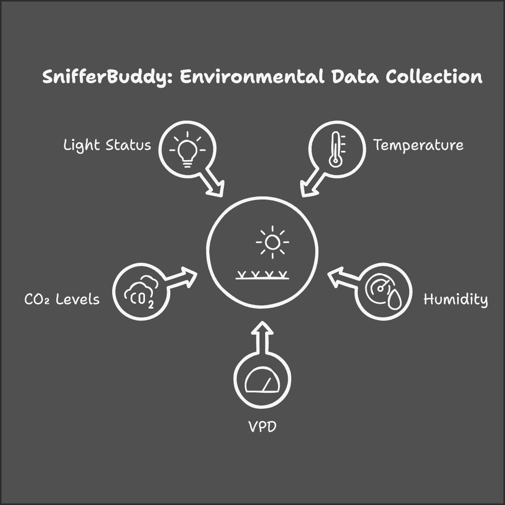
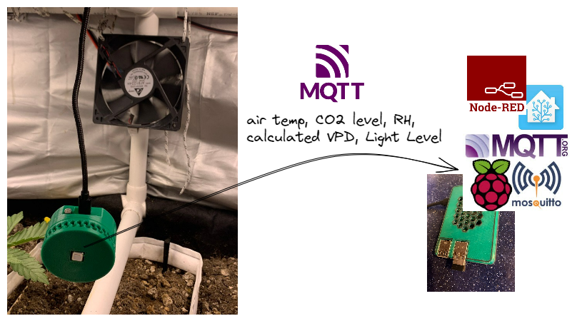
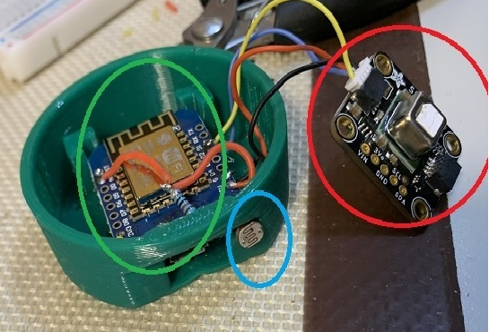

# 🤖👃 SnifferBuddy

  

## 💡 About

SnifferBuddy is a puck-shaped device designed for indoor grow environments, monitoring key ambient conditions such as temperature, humidity, VPD, CO₂ levels, and light status. It uses a SCD40 (or SCD41) sensor and a photoresistor for precise measurements within the grow tent.

  

The readings are transmitted via `MQTT`, enabling seamless integration with workflows such as Node-RED, Home Assistant, or custom applications. This package includes support for storing readings in a local DuckDB database for data analysis and post-processing. A [GrowBase](https://github.com/solarslurpi/GrowBase) is needed to store the data.

The system operates entirely on your local Wi-Fi network, ensuring no data is sent to the Internet.

Deploy multiple SnifferBuddies to gain a detailed, nuanced view of the entire grow space.

## 🔧 Hardware
  
### 🛠️ Components

Opening up the SnifferBuddy

  

reveals its components:
- ESP8266 Wemos Mini D1
- SCD40 or SCD41 sensor
- Resistor
- Photoresistor
- 3D-printed enclosure
- thin wire

#### 🏗️ Build One

Building a SnifferBuddy requires basic soldering skills. For detailed instructions on how to assemble it, check out the [Build Guide](docs/build_guide.md).

## 💾  Software

### ⚙️ Setup the Firmware

With the enclosure assembled and components installed, it's time to set up and configure the firmware.  This is covered in the [Firmware Guide](docs/firmware_guide.md).

### 📥 Setup Data Collection

The [Data Collection Guide](docs/data_collection_guide.md) covers how to setup the data collection process.

### 📈 Explore the Data

There are a variety of tools available to explore the data. As an example, a [marimo notebook](https://marimo.io/) is included in the `examples` folder. First, install `pip install marimo`. Then run `marimo edit examples/play_with_sniffer_data.py` to open the notebook. I copied a version of the duckdb database from my GrowBase to the `examples` folder to have data readily available to play with.  

#### 🚀 Run the notebook on the GrowBase
To run the `marimo` notebook on the `Raspberry Pi`, install `marimo` and copy the `play_with_sniffer_data.py` notebook to a directory on the `Raspberry Pi`. In the same directory, start `marimo` with the `--host` flag. `marimo edit --host 0.0.0.0 /home/pi/snifferbuddy/notebooks/play_with_sniffer_data.py`. The URL will have the IP address of `0.0.0.0` when you click on the link. Replace `0.0.0.0` with the IP address of the `Raspberry Pi`. The notebook should now be running on the `Raspberry Pi`.

## ℹ️ SCD4x Details

### 🎯 Accuracy - SCD4x

Refer to sections 1.1–1.3 of the [SCD4x datasheet](docs/CD_DS_SCD40_SCD41_Datasheet_D1.pdf) for details on the accuracy range and expected lower and upper bounds for CO2, relative humidity, and temperature measurements. For example, if the temperature reads 70° F, the actual value can range from 68.6° to 71.4° F.

### 🌡️ Adjusting Temperature Offset

The [SCD4x datasheet](docs/CD_DS_SCD40_SCD41_Datasheet_D1.pdf) (section 3.6) details the On-Chip Output Signal Compensation mechanism, which adjusts for temperature inaccuracies caused by self-heating from the sensor and nearby electronics. This temperature offset is initially set to 4°C. It can be adjusted within a range of 0°C to 20°C to address additional environmental factors, providing a means to calibrate the sensor for greater accuracy.

