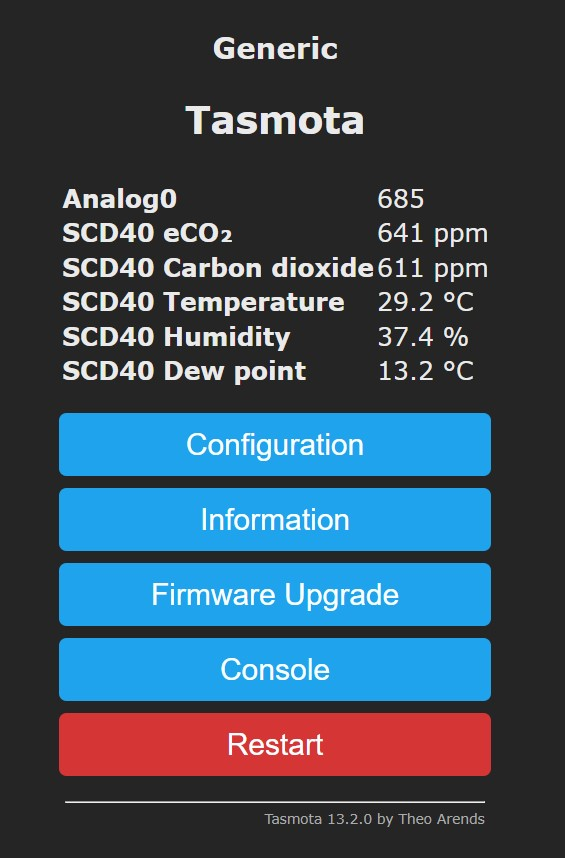

# SnifferBuddy Puck Firmware
The firmware is [Tasmota](https://tasmota.github.io/docs/), a popular open-source firmware for ESP8266/ESP32 devices. Tasmota provides:
- A robust web interface for configuration.
- Built-in MQTT support.
- Over-the-air (OTA) updates.
- Support for a variety of Sensors.
- Support to add drivers for additional sensors.
- Automatic reconnection handling for both WiFi and MQTT.
## Installation
Installation assumes you have a [SnifferBuddy Puck](snifferbuddy_puck.md).
- Before you begin, make sure:
    - you have a USB data cable.  Cheaper USB cables do not support data transfer.
    - your OS has a CH340/CH341 driver installed.  I run on Windows 10 and use the CH340 driver. [This documentation gives install info for Windows, Mac, and Linux](https://sparks.gogo.co.nz/ch340.html).

- How do i install Tasmota sensor for SCD40 on the ESP826? I used to have documentation.  The other thing is how do i set the properties so i don't need to do them through the UI?

[Compile your build](https://tasmota.github.io/docs/Compile-your-build/)

The guild above walks through getting to the Tasmota build environment using `GitPod`.  It is a very simple and fast way to get started.  The guide notes all modifcations should be done in `user_config_override.h`. This file is located in the `/tasmota` directory.

The `my_user_config.h` file contains default configurations and serves as a reference for available options. However, users are advised not to modify this file directly.

The additions to the bottom of the `user_config_override.h` file are:
```
#define USE_SCRIPT            // Enable scripting feature
#undef USE_RULES             // Disable rules
// Disable unused drivers taking up memory.
#undef USE_PCA9685
#undef USE_PCF8574
#undef USE_DISPLAY_LCD
#undef USE_DISPLAY_MATRIX
#undef USE_ADE7953
#undef USE_TC74
#undef USE_PCA9557
#undef USE_SGP4X
#undef USE_MAX17043
#undef USE_ENS16x
#undef USE_RX8010
#undef USE_MS5837
// Enable the SCD40 driver
#define USE_SCD40
```
After saving the changes, compile the firmware by typing `platformio run -e tasmota-sensors` in the terminal.

When done, the firmware files are in the folder `/Tasmota/build_output/firmware/`.

To install a local copy of the firmware, the minimal build needs to be installed first. I think. try this.

[Development binaries for Tasmota firmware 14.3.0.7 on ESP8266](https://ota.tasmota.com/tasmota/)

- To web install Tasmota, use either the Edge or Chrome web browser (the web install method does not work with Brave). Navigate to [the Tasmota Install URL](https://tasmota.github.io/install/). The first thing the Tasmota install will want to do is connect to the ESP.

## Accessing the UI
- Connect to your network and locate your SnifferBuddy's IP address. I use the AngryIP Scanner tool for this.
- Once you find the IP address, enter it in a web browser

The main page displays current sensor readings and device status.
<figure style="text-align: center; margin: auto;">
    
    <figcaption style="text-align: center">Tasmota main screen showing SCD40 readings</figcaption>
</figure>

## Configuration Settings

The configuration for the Sensor Monitoring System is managed through a combination of a Python module (`config.py`) and a YAML file (`config.yaml`). This setup allows for flexible and easy-to-manage configuration settings that can be adjusted without modifying the application code.

### Configuration Files

1. **`config.py`**: This Python module defines the structure and default values for the application's configuration using Pydantic, a data validation and settings management library. It provides a programmatic way to load and validate configuration data, ensuring that all required fields are present and correctly typed.


2. **`config.yaml`**: This YAML file contains the actual configuration settings for the application. It is designed to be user-editable, allowing you to customize the application's behavior by changing the values in this file. If the file is not present, the application will fall back to default settings defined in `config.py`.

### Configuration Properties

The configuration is divided into two main sections:

#### MQTT Configuration

- **`host`**: The hostname or IP address of the MQTT broker. This is where the application will connect to receive sensor data. Default is `"localhost"`.
- **`port`**: The port number on which the MQTT broker is listening. The default port for MQTT is `1883`.
- **`topic_prefix`**: The prefix for MQTT topics that the application will subscribe to. This allows the application to filter messages based on topic hierarchy. Default is `"sensors/#"`, which subscribes to all topics under `sensors`.
#### Database Configuration
- **`database_path`**: The file path to the SQLite database where sensor readings will be stored. This path can be absolute or relative, and it defaults to a hidden directory in the user's home folder: `"~/.sensor_monitor/readings.db"`.
### How to Use
1. **Edit `config.yaml`**: Open the `config.yaml` file in a text editor and modify the values as needed to match your environment and requirements.