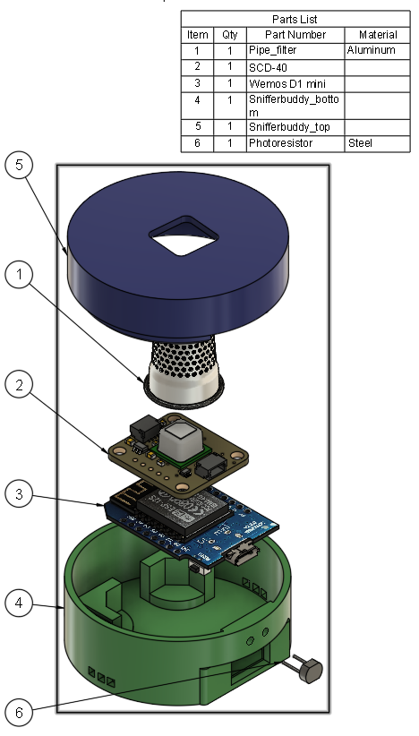
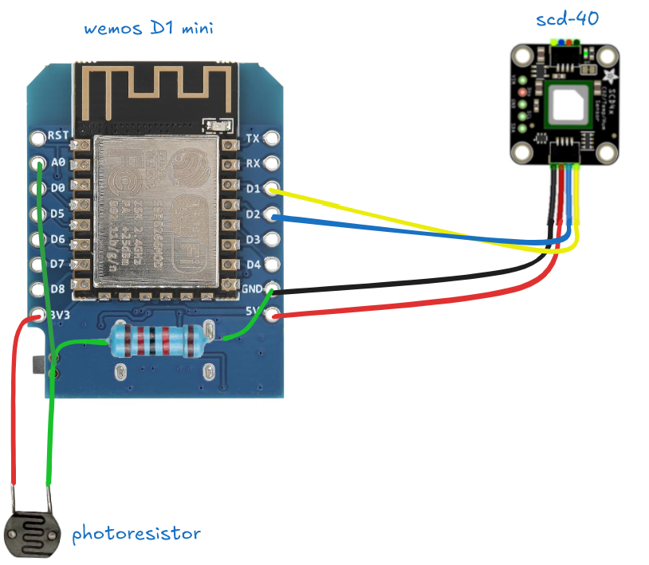

# Build Guide

Before putting all the hardware pieces together, I like to first get Tasmota installed on the ESP286.  Follow the steps in the [Firmware Guide](firmware_guide.md) up to the step involving`i2cdriver`.  The `SCD4x` has not been connected yet.

The steps to build a SnifferBuddy include:
1. Get the parts
2. Print out the enclosure

## Parts

Before assembly, gather the following components:

| Part | Cost | Description |
| --- | ----------- | -------------------------------------------------------------------------------------------------------------------------------------------------------------------------------------------------------------- |
| Enclosure | pennies | The design is an evolution of the wonderful [Tiny-D1 modular case for Wemos D1 mini by sumpfing](https://www.thingiverse.com/thing:4084654). |
| Wemos D1 mini | $0.99 - $16 | These can be purchased on AliExpress or Amazon. When I started this project, there weren't as many Wemo D1 options. I use the least expensive and oldest Wemos D1 mini.  Best to buy a few. |
| SCD40 w/ STEMMA QT | $45 | The STEMMA QT connector is fully compatible with the Qwiic connector. [Purchasing from Adafruit](https://www.adafruit.com/product/5187) ensures excellent quality and reliable support from a trusted company. |
| [STEMMA QT connector](https://www.adafruit.com/product/4399) |$0.95 | A JST-SH 4 pin connector with a 1.0 mm pitch.|
| Photoresistor | $6 / 30 | This is a common component you can get from [Amazon](https://amzn.to/3Pa9J5R) or AliExpress. |
| 12K resistor | $5.50/100 | This is a common component you can get from [Amazon](https://amzn.to/3VWBaUv) or AliExpress. |
| [1/2" pipe filter](ygh!vgd0YJA!yun4uyc) | $6/40 | This is used to cover the SCD40 but still allow it to sniff the air. |
| Wire | $15 | I like to use [silicone wires like this wire kit on Amazon](https://amzn.to/4iRjjIA). |
| USB cord | $5-$9 | **Make sure the cable support data transfer**. If the Wemos version is 3 or earlier, the cable is the micro-B USB. Wemos 4 and later use USB-C. |

  

## Print the Enclosure

The two mesh files can be loaded into a 3D printer slicer program.
- [the top](../enclosure/mesh_files/snifferbuddy_top.3mf)
- [the bottom](../enclosure/mesh_files/snifferbuddy_bottom.3mf)

The enclosure was designed in Fusion 360.  The Fusion 360 files are located in the `enclosure\F360 files` folder.  The folder includes the F360 files for all the components.

## Assemble and Wire
Before soldering, insert the photoresistor into the holes on the top part of the enclosure. Then go onto wiring. 

### Wiring
The SCD-40 sensor has the STEMMA QT connector.  The Wemos D1 mini does not. Cut the wires of the STEMMA QT connector and along with the photoresistor, solder them to the Wemos D1 mini as shown in the image below.

  

### Assemble
Insert the pipe filter into the hole at the top of the enclosure, securing it with a small amount of sticky tape or hot glue. Connect the SCD-40 sensor to the STEMMA QT connector. Next, place the Wemos D1 Mini into the bottom section, ensuring the USB connector aligns with the designated cutout. Place the SCD-40 on the top of the sensor.  Here I used two sided tape to keep it in place.

Close the top and bottom sections, then twist the top slightly clockwise to secure it in place.

