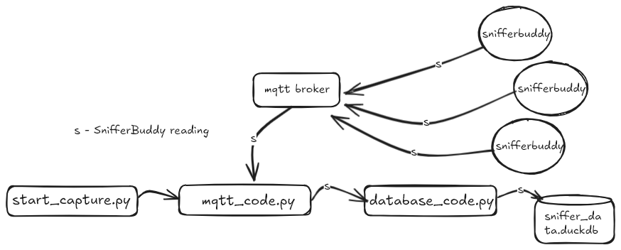

# Data Collection Guide

The SnifferBuddy project comes with software that listens for the SnifferBuddy readings coming in over mqtt and:
- calculates the vpd.
- stores the reading into a SQLite database. 

This way, any UI that can read/write SQLite tables (e.g.: DB Browser) can be used to view the data.

SnifferBuddy is one of the Buddies being built for a grow tent.  There are others - like MistBuddy that maintains the vpd level, and CO2Buddy - that maintains the CO2 level.  In order to have the buddies always running and centrally located, we run the software of the Buddies on what we call a [GrowBase](https://github.com/solarslurpi/GrowBase).


# How the Code Works

<p align="center">
  
</p>

The workflow for handling SnifferBuddy readings involves the following steps:

1. **Starting the Workflow**  
    The process begins with the `start_capture.py` script, which initializes the capture and processing of readings.
    
2. **Listening for Readings**  
    The `mqtt_code.py` script uses MQTT to listen for SnifferBuddy readings. It receives the data and processes it.
    
3. **Processing the Readings**  
    The readings are transformed into a `SCD4XSensorReading` Pydantic model, which includes the calculation of `vpd` (vapor pressure deficit).
    - **VPD Calculation**: The `vpd` is derived using the temperature and relative humidity from the reading.
    - **Assumption**: Leaf temperature is assumed to be 2°C lower than the air temperature.
4. **Storing the Processed Data**  
    The processed reading is passed to `database_code.py`, which saves it into the `sniffer_data.sqlite` database file.
## Database Schema: The `readings` table

The schema consists of one table, the `readings` table.

Below is a detailed description of each column in the schema:

| **Column Name** | **Data Type** | **Description**                                                                  |
| --------------- | ------------- | -------------------------------------------------------------------------------- |
| `timestamp`     | `TIMESTAMP`   | The primary key. Indicates the time the reading was taken.                       |
| `device_name`   | `TEXT`        | The name or identifier of the SnifferBuddy device providing the reading.         |
| `light_on`      | `INTEGER`     | Indicates whether the light was on (`TRUE`) or off (`FALSE`) during the reading. |
| `CO2`           | `INTEGER`     | The CO2 concentration level measured in parts per million (ppm).                 |
| `temperature`   | `REAL`        | The air temperature at the time of the reading.                                  |
| `humidity`      | `REAL`        | The relative humidity percentage recorded.                                       |
| `vpd`           | `REAL`        | The calculated vapor pressure deficit (in kPa).                                  |
| `dew_point`     | `REAL`        | The dew point temperature.                                                       |
| `temp_unit`     | `TEXT`        | The unit of the temperature reading,  `"C"` (Celsius) or `"F"` (Fahrenheit).     |
# Installation

## Install pipx

```
sudo apt update && sudo apt install pipx
```

pipx install --force git+https://github.com/solarslurpi/snifferbuddy

go to:
/lib/systemd/system

copy the snifferbuddy service file:

sudo wget https://raw.githubusercontent.com/solarslurpi/snifferbuddy/main/snifferbuddy.service

sudo systemctl enable snifferbuddy

